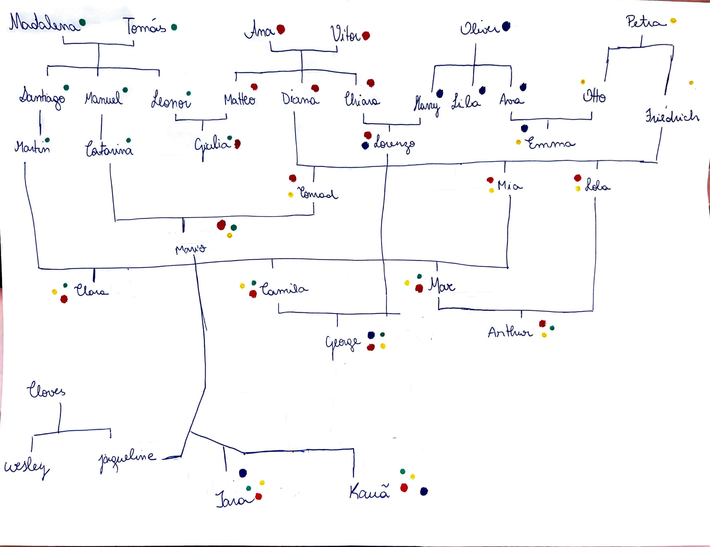

# Citizenship-Query

Este projeto implementa, em **Prolog**, um sistema capaz de determinar se um(a) brasileiro(a) nato(a) tem direito à cidadania **italiana**, **portuguesa**, **britânica** ou **alemã**, com base nas nacionalidades e históricos de naturalização de seus antepassados. 

Observação: Nesta aplicação, a distinção entre nacionalidade e cidadania foi abstraída. Assim, ao adquirir a cidadania, a pessoa passa a ser considerada a nova origem da linha de transmissão dessa cidadania para seus descendentes.

## Regras Simplificadas de Herança de Cidadania

- **Itália 🇮🇹** → Transmissão sem limite de gerações.
- **Portugal 🇵🇹** → Transmissão até **netos** de portugueses.
- **Reino Unido 🇬🇧** → Apenas se um dos pais for cidadão britânico.
- **Alemanha 🇩🇪** → Transmissão até **netos** de alemães.

## Estrutura da Base de Dados

A base de fatos utiliza os seguintes predicados:
```
pai(X, Y).
mae(X, Y).
cidadania(X, Y).
```

A árvore genealógica da base de dados está descrita abaixo. 
Note que a cidadania que uma pessoa já possui está escrita ao seu lado nesse diagrama.

``` 
 ├── Tomas 🇵🇹 + Madalena 🇵🇹
 │    ├── Santiago 🇵🇹
 │    │    └── Martin 🇵🇹
 │    │         ├── Clara
 │    │         ├── Camila + Lorenzo 🇮🇹/🇬🇧
 │    │         │    └── George
 │    │         └── Max + Lola 🇩🇪
 │    │              └── Arthur
 │    ├── Manuel 🇵🇹
 │    │    └── Catarina 🇵🇹 + Conrad 🇩🇪
 │    │         └── Mario
 │    │              └── (com Jaqueline)
 │    │                   ├── Iara
 │    │                   └── Kaua
 │    └── Leonor 🇵🇹 + Matteo 🇮🇹
 │         └── Giulia
 │
 ├── Vitor 🇮🇹 + Ana 🇮🇹
 │    ├── Matteo 🇮🇹 (casado acima com Leonor 🇵🇹)
 │    ├── Diana 🇮🇹 + Friedrich 🇩🇪
 │    │    ├── Conrad 🇩🇪 (casado acima com Catarina 🇵🇹)
 │    │    ├── Mia 🇮🇹 + Martin 🇵🇹 (casado acima)
 │    │    └── Lola 🇩🇪 (casada acima com Max)
 │    └── Chiara 🇮🇹 + Harry 🇬🇧
 │         └── Lorenzo (casado acima com Camila)
 │
 ├── Cloves
 │    ├── Wesley
 │    └── Jaqueline (casada acima com Mario)
 │
 ├── Oliver 🇬🇧
 │    ├── Harry 🇬🇧 (casado acima com Chiara 🇮🇹)
 │    ├── Lila 🇬🇧
 │    └── Ava 🇬🇧 + Otto 🇩🇪
 │         └── Emma
 │
 └── Petra 🇩🇪
      ├── Otto 🇩🇪 (casado acima com Ava 🇬🇧)
      └── Friedrich 🇩🇪 (casado acima com Diana 🇮🇹)
 ```

Já na imagem, estão destacadas as trilhas de descendência por meio de pontos coloridos.
Cada cor representa uma cidadania:
 - Italiana - ponto vermelho;
 - Alemã - ponto amarelo;
 - Britânica - ponto azul;
 - Portuguesa - ponto verde.

Os nomes dos personagens da primeira geração foram idealizados de forma que representassem nomes típicos de cada país de origem.



## Exemplos de uso

```
?- tem_direito(george, portugal).
?- tem_direito(iara, italia).
?- tem_direito(arthur, X).
?- tem_direito(X, alemanha).
```


